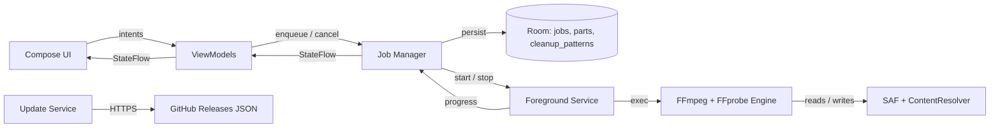

# Architecture

> Single-module Android project. Clean boundaries by package; future split
> into `:domain`, `:engine`, `:data`, `:app` is mechanical (move package →
> module).

## 1. Big picture



## 2. Layers (by package)

| Layer | Package | Knows about | Doesn't know about |
|---|---|---|---|
| UI | `ui/`, `theme/`, `nav/` | ViewModels, theme tokens | Engine, JNI, Room |
| ViewModel | `ui/.../*ViewModel` | Domain, repositories | Compose, Android views |
| Domain | `domain/` | Pure Kotlin only | Android, Compose |
| Engine | `engine/` | Process invocation, JNI | UI, Compose |
| Service | `service/` | Engine, Repository | Compose |
| Data | `data/` (Room, DataStore) | Entities, DAOs | UI, Compose |
| Platform | `platform/` (SAF helpers) | Android URIs, `ContentResolver` | Domain logic |
| Update | `update/` | Retrofit, `PackageInstaller` | Engine, UI |
| DI | `di/` | All of the above | Nothing — only wiring |

The dependency direction is **strictly downward**. Compose may depend on
ViewModel; ViewModel may depend on Domain + Repository; Domain may depend on
nothing Android.

## 3. Threading model

| What | Dispatcher |
|---|---|
| UI | `Dispatchers.Main` |
| ViewModel transformations | `Dispatchers.Default` |
| FFmpeg / FFprobe invocation | `Dispatchers.IO` |
| Room queries | `Dispatchers.IO` (Room handles internally with `suspend`) |
| Network (update check) | `Dispatchers.IO` |

Concurrency primitives:

- One `Job` per running FFmpeg invocation; cancellable via
  `CoroutineScope.cancel()` → which sends `SIGINT` to the underlying process.
- `Mutex` per output file path prevents two jobs writing the same target.
- `MutableSharedFlow<Progress>` from engine → service → repository → VM.

## 4. Foreground service

```xml
<service
    android:name=".service.JobService"
    android:foregroundServiceType="dataSync"
    android:exported="false" />
```

Lifecycle:

1. VM `enqueueJob(job)` → `startForegroundService(intent)`.
2. Service shows persistent notification (channel `IMPORTANCE_LOW`) with
   progress + cancel.
3. Service runs jobs **sequentially** (Q17 = one at a time).
4. Queue empty → `stopForeground(STOP_FOREGROUND_REMOVE)` + `stopSelf()`.

Why a service and not WorkManager: WorkManager imposes constraints
(network/charging/battery) that interfere with multi-hour video jobs. A pinned
foreground service is the canonical Android way for user-initiated long work.

## 5. Storage strategy (SAF)

### Reading the input

User picks input via `ACTION_OPEN_DOCUMENT`. We obtain a `content://` URI
plus persistent read permission.

To pass to FFmpeg:

1. **Path resolution** (preferred). Try to map URI → real path via
   `MediaStore` / `DocumentsContract`. Works for ~95 % of internal storage
   and SD-card files.
2. **`pipe:` fallback.** Open `ParcelFileDescriptor`, pass `pipe:N`. Works
   for everything but is slower and seek-restricted (no random access for
   `-ss`). v1 prefers (1); falls back to (2) only for read of small chunks.

If both fail, we ask the user to copy the file to local storage.

### Writing the parts

User picks output **folder** with `ACTION_OPEN_DOCUMENT_TREE`. We create part
files via `DocumentsContract.createDocument()` and obtain `content://` URIs.
For FFmpeg, we write to **app-private cache** first
(`getExternalFilesDir(...)`), then copy/move to the SAF location on success.

## 6. Permissions

| Permission | Purpose | When |
|---|---|---|
| `FOREGROUND_SERVICE` | Required for any FGS | always |
| `FOREGROUND_SERVICE_DATA_SYNC` | A14+ specific | always on A14+ |
| `POST_NOTIFICATIONS` | Show progress notification | A13+ runtime request |
| `WAKE_LOCK` | Keep CPU on during long job | always |
| `INTERNET` | Update check (update.json + APK download) | always |
| `REQUEST_INSTALL_PACKAGES` | Install in-app updates | release variant only |
| `REQUEST_IGNORE_BATTERY_OPTIMIZATIONS` | Optional reliability boost | user-triggered from Settings |
| (No) `READ_MEDIA_VIDEO` | Not needed; we use SAF | — |
| (No) `MANAGE_EXTERNAL_STORAGE` | Play Store policy red flag | **never request** |

## 7. Module boundary contracts

```kotlin
// Domain — pure Kotlin, no Android imports
interface Splitter {
    suspend fun runSplit(job: SplitJob): Flow<SplitProgress>
}

// Engine — wraps FFmpeg, exposes Domain interface
class FfmpegSplitter @Inject constructor(
    private val ffmpeg: FfmpegEngine,
    private val ffprobe: FfprobeEngine,
    private val planner: CutPlanner
) : Splitter

// Service — wraps Domain in a service lifecycle
@AndroidEntryPoint
class JobService : Service() {
    @Inject lateinit var splitter: Splitter
    @Inject lateinit var merger:   Merger
    // ...
}
```

Domain layer **never** imports `androidx.*` or `android.*`.

## 8. Errors

Every engine invocation returns `Result<Unit>` with structured failure:
process exit code, last 200 lines of stderr, classification:

```kotlin
sealed class EngineError {
    data class InsufficientStorage(val needed: Long, val have: Long) : EngineError()
    data class InputUnreadable(val uri: String) : EngineError()
    data class OutputWritePermission(val uri: String) : EngineError()
    data class CodecMismatch(val partIdx: Int, val detail: String) : EngineError()
    data object Cancelled : EngineError()
    data class Other(val exitCode: Int, val stderrTail: String) : EngineError()
}
```

ViewModels map to user-friendly text; raw stderr is available on a "Show
technical details" tap.

## 9. Test boundaries (mirrors layers)

- `domain/` → JVM unit tests with no Android imports (fastest).
- `engine/` → JVM unit tests for parsers; instrumented smoke tests for the
  real binary.
- `data/` → Room test helpers; in-memory DB.
- `ui/` → Compose UI tests on a real device or emulator.
- `platform/saf/` → UI Automator (cross-app picker flow).
- `service/` → manual + smoke; instrumented test that verifies notification
  channel and FGS lifecycle.

See [TESTING.md](TESTING.md) for the full coverage map.

## 10. Why not Media3 / MediaCodec for split?

MediaCodec / MediaMuxer / MediaExtractor are great for re-encoding, frame
extraction, and playback — none of which we do. They are bad for:

- MKV write (read-only / partial across Android versions).
- Multi-subtitle preservation.
- PGS / VobSub bitmap subtitle write.
- Concat (no first-class operation).

So MediaCodec may appear in v1.x for **thumbnails** on the File Details
screen, but never for the engine.
