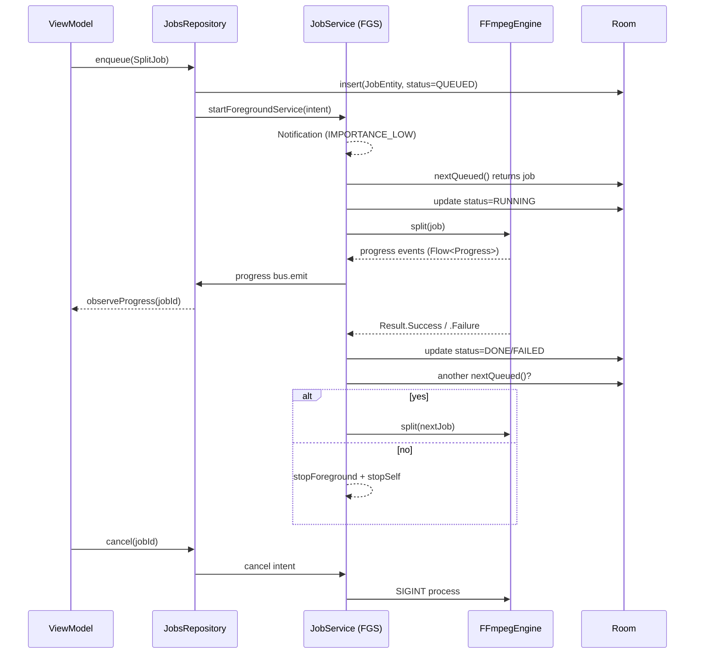
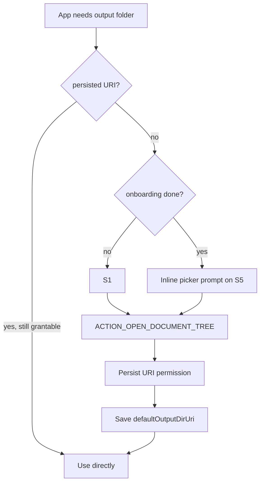

# Screen Flows

> Mermaid diagrams that an agent can use to wire `NavHost` and verify routes.
> When flows change, **update this file** and re-render diagrams.

## 1. End-to-end navigation

```mermaid
flowchart TD
    Launch([App launch]) -->|first run| S1[S1 Onboarding]
    Launch -->|subsequent| S2[S2 Library]
    S1 -->|Pick output folder OR Skip| S2

    S2 -->|+ Split (FAB / nav)| S3[S3 SAF picker — file]
    S2 -->|+ Merge (FAB / nav)| S9[S9 SAF picker — first part]
    S2 -->|tap row, status RUNNING| S7[S7 Split Progress]
    S2 -->|tap row, status DONE| S8[S8 Split Result]
    S2 -->|nav: Queue| S14[S14 Jobs]
    S2 -->|nav: Settings| S15[S15 Settings]

    S3 --> S4[S4 File Details]
    S4 --> S5[S5 Split Config]
    S5 --> D1{D1 Cleanup preview?}
    D1 -->|Edit title| S5
    D1 -->|Use as-is| D2{D2 Folder exists?}
    D1 -->|hidden via Settings| D2
    D2 -->|Use / suffix / cancel| D3{D3 Container promotion?}
    D3 --> S6[S6 Confirm]
    S6 -->|Start split| S7
    S7 -->|DONE| S8
    S7 -->|FAILED| ErrSheet[Error sheet]
    S8 -->|Make merge job| S10[S10 Order parts]
    S8 -->|Open folder / Share| S2

    S9 -->|manifest detected| S11[S11 Merge Config]
    S9 -->|no manifest| S10
    S10 --> S11
    S11 --> S12[S12 Merge Progress]
    S12 -->|DONE| S13[S13 Merge Result]
    S13 --> S2

    S14 -->|tap row| Detail[Job detail sheet]
    Detail -->|cancel| S14
    Detail -->|open output| S2

    S15 --> S15a[S15a Cleanup Patterns]
    S15 --> S16[S16 OSS Notices]
    S15 -->|Check for updates| Updater((Update flow))

    classDef system fill:#1a1a1a,stroke:#888,color:#fff
    class S3,S9 system
```

System SAF screens (S3, S9) are not designed by us; the diagram shows the
hand-off only.

## 2. Background service lifecycle



## 3. Cancel / resume

```mermaid
flowchart LR
    A[User taps Cancel] -->|Confirmation sheet| B[Cancel sheet]
    B -->|Yes| C[Repository.cancel(jobId)]
    C --> D[Service interrupts FFmpeg]
    D --> E[Partial part .tmp files removed]
    E --> F[Job status = CANCELLED]
    F --> G[UI returns to Library]

    H[App killed mid-job] --> I[Next launch]
    I --> J[Migration: RUNNING jobs → FAILED with reason 'interrupted']
    J --> K[Partial .tmp files cleaned]
    K --> L[User may retry]
```

In v1 there is **no resume mid-job** — a cancelled or interrupted job restarts
from part 1 if the user retries. Resume from a partial-job state lands in
v0.0.3 per the roadmap.

## 4. Update check

```mermaid
flowchart LR
    User[User taps Check for updates] --> VM[SettingsViewModel]
    VM --> Up[UpdateService]
    Up -->|HTTPS GET| GH[(videosplitter-version.json)]
    GH --> Up
    Up -->|compare versionCode| VM
    VM -->|already up to date| Toast[Snackbar "Up to date"]
    VM -->|update available| Sheet[Update sheet]
    Sheet -->|Download| Up
    Up -->|HTTPS GET .apk| File[Local cache APK]
    File -->|verify SHA-256 vs JSON| OK{match?}
    OK -->|no| Err[Error: tampered APK]
    OK -->|yes| Inst[PackageInstaller]
    Inst --> SystemUI[System install screen]
    SystemUI --> Done[App restarts new version]
```

## 5. SAF permission flow



## 6. Queue ordering rules

```mermaid
flowchart TD
    A[New job enqueue] -->|insert with status=QUEUED| DB[(jobs table)]
    DB --> Sched[Service scheduler]
    Sched -->|nextQueued() ORDER BY createdAt ASC LIMIT 1| Pick
    Pick -->|None| Stop[stopForeground + stopSelf]
    Pick -->|Found| Run[Run job]
    Run -->|Done / Failed / Cancelled| Sched
```

Q17 = one job at a time. Parallel runs are explicitly out of scope for v1.

## 7. Error / dialog flows

```mermaid
flowchart TD
    Start[Engine fails] --> Class{error type}
    Class -->|InsufficientStorage| ErrA[Sheet: needs X GB free]
    Class -->|InputUnreadable| ErrB[Sheet: file moved/deleted]
    Class -->|OutputWritePermission| ErrC[Sheet: re-grant folder]
    Class -->|CodecMismatch (merge)| ErrD[Inline red rows on S10]
    Class -->|Cancelled| Quiet[Silent return to Library]
    Class -->|Other| ErrE[Sheet: code N + Show details]

    ErrA -->|Free up + retry| Sched
    ErrC -->|Re-pick folder| Picker
```

## 8. Foreground service notification taps

| Notification action | Destination |
|---|---|
| (body tap) | Open S7/S12 for the running job |
| Cancel | Same as the in-app Cancel sheet |
| Open folder | Open SAF tree for the output dir |

## 9. Tablet vs phone

Phone uses the bottom nav. Tablet (≥ 800 dp) collapses to a left **rail**
plus a 360 dp list pane plus a flexible detail pane. The diagrams above are
form-factor agnostic; routes are identical.

## 10. When this file changes

Edit only when:

- A new screen is added to the app.
- A navigation edge between two existing screens changes.
- A dialog is added/removed.
- The service contract changes (e.g. new background lifecycle event).

After editing, render the Mermaid blocks in a viewer and confirm they parse;
broken Mermaid breaks GitHub previews.
