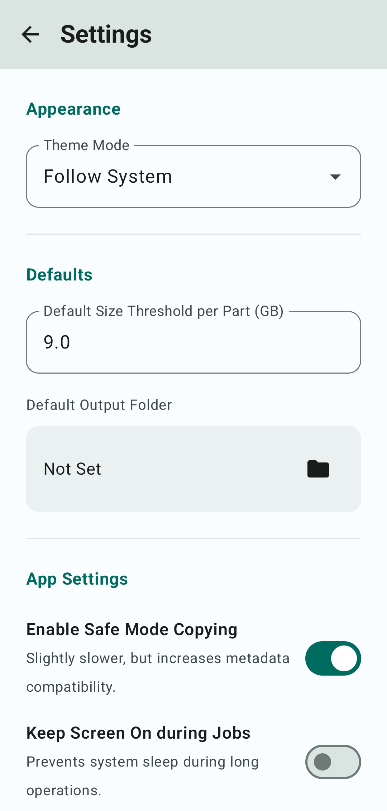

# Video Splitter (MKV Slice)

An Android application (applicationId `com.splitandmerge.mkvslice`) for lossless splitting and merging of large video files (MKV, MP4, AVI, WebM, MOV, TS) at keyframe boundaries.

## Features
- **Lossless Cut / Merge**: Links to LGPL FFmpeg, using stream-copy without re-encoding to preserve 4K/HDR quality.
- **Set Default Tracks**: Reconfigure default/forced stream flags inside Matroska headers in batch.
- **Batch Rename Videos (Title-Clean)**: Batch clean media filenames matching custom cleanup patterns.
- **Multi-Stream & Track Preservation**: Keeps all audio, subtitle (SRT, ASS, PGS, VobSub), chapters, and attachment (font) tracks.
- **Smart Splitting**: Intelligent time-based planning with custom size limits or part quantities.
- **Foreground Service Processing**: Reliable processing using low-priority background execution to bypass OS restrictions.
- **Privacy & Security**: Operates completely offline with zero telemetry (no tracking), and handles all file operations securely through Storage Access Framework (SAF).
- **In-App Updater**: Automatically checks for updates and verifies SHA-256 signatures before updating.

## Screenshots & How to Use

A step-by-step [Usage Guide](docs/USAGE.md) is available. Here are visual previews of the key screens in the application:

| Library Home | Set Default Tracks | Batch Rename Videos |
| --- | --- | --- |
|  |  |  |

| Track Editor | Title Cleanup Patterns | Settings & Theme |
| --- | --- | --- |
|  |  |  |


## Development Setup

### Toolchain Requirements
- **JDK**: Version 17
- **Kotlin**: 2.0.x
- **Android Gradle Plugin (AGP)**: 8.x
- **Build Environment**: Windows + PowerShell + Physical device / emulator on ADB

### Building from Source
Run the following tasks to lint, test, and build:

```powershell
# Run Android Lint
.\gradlew.bat lint

# Run Unit Tests
.\gradlew.bat test

# Build Debug APK
.\gradlew.bat :app:assembleDebug
```

### Installation
Deploy the debug build to a connected ADB device:
```powershell
$adb = "D:\idm\platform-tools-latest-windows\platform-tools\adb.exe"
& $adb devices
& $adb install -r "app/build/outputs/apk/debug/app-debug.apk"
```

### Verification
Run the instrumented test suite using the helper script:
```powershell
.\run-tests.ps1
```

## License
Licensed under the Apache License, Version 2.0.
