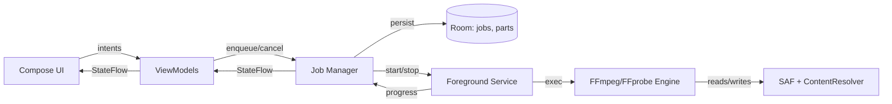

# 06 — Android Architecture

## 6.1 Big picture



## 6.2 Layers

| Layer | Responsibility | Key types |
|---|---|---|
| **UI** | Compose screens, navigation, Stitch-styled widgets | `MainActivity`, `*Screen.kt`, `theme/` |
| **ViewModel** | Screen state + intent handling | `LibraryViewModel`, `SplitConfigViewModel`, `MergeConfigViewModel`, `JobsViewModel`, `SettingsViewModel` |
| **Domain** | Pure logic: cut planning, manifest, validation | `Splitter`, `Merger`, `Probe`, `Manifest`, `CutPlanner` |
| **Engine** | Process invocation + stream IO | `FfmpegEngine`, `FfprobeEngine` (JNI / process) |
| **Service** | Foreground job lifecycle, notifications | `JobService` (single instance, multi-job aware) |
| **Data** | Persistence | Room: `JobEntity`, `PartEntity`, `SettingsStore` |
| **Platform** | SAF wrappers, path resolution | `SafFile`, `PathResolver` |

## 6.3 Threading & coroutines

- **UI** → `Dispatchers.Main`.
- **ViewModel** transformations → `Dispatchers.Default`.
- **IO + FFmpeg invocation** → `Dispatchers.IO`.
- One `Job` per running ffmpeg invocation; cancellable via `CoroutineScope.cancel()` → which sends `SIGINT` to the underlying process.
- A single `Mutex` per **output file path** prevents two jobs writing the same target.

## 6.4 Foreground service design

Android 14+ requires `foregroundServiceType` to be declared and matched at runtime. Best fit: `dataSync` (and on 15+ optionally `mediaProcessing` if available; fall back to `dataSync`). Permission: `FOREGROUND_SERVICE_DATA_SYNC`.

```xml
<service
    android:name=".service.JobService"
    android:foregroundServiceType="dataSync"
    android:exported="false" />
```

Service lifecycle:

1. `enqueueJob(job)` from VM → `startForegroundService(intent)`.
2. Service shows persistent notification with progress + cancel action.
3. Service runs jobs sequentially (configurable later) on `Dispatchers.IO`.
4. When queue empty → `stopForeground(STOP_FOREGROUND_REMOVE)` + `stopSelf()`.

Why a service and not WorkManager: WorkManager imposes `setExpedited` quota and constraints (network/charging/battery) that interfere with long jobs. A pinned foreground service with proper notifications is the canonical Android way for hour-long user-initiated operations.

## 6.5 Storage strategy (SAF)

### Reading the input

User picks the input file with `ACTION_OPEN_DOCUMENT`. We obtain a `content://` URI plus persistent read permission.

To pass to FFmpeg, two paths:

1. **Path resolution** (preferred when possible). Try to resolve the URI to a local path via `MediaStore` / `DocumentsContract` → if a real path exists, use it directly. Works for ~95% of internal storage and SD-card files.
2. **`pipe:` fallback.** Open `ParcelFileDescriptor` from the URI, pass `pipe:N` (where N is `pfd.fd`) to FFmpeg. Works for everything but is slower and seek-restricted (split needs random access via `-ss`, which a pipe doesn't allow). For pure split with `-ss` we therefore **cannot** rely on `pipe:` for the input.

**Rule:** if the input cannot be resolved to a real path, we ask the user to copy/move it to a real folder (or, at user's request, we can copy it ourselves to app-private storage as a one-time "import"). v1 will show a clear error; v1.x can offer the copy.

### Writing the parts

User picks an output **folder** with `ACTION_OPEN_DOCUMENT_TREE`. We create part files via `DocumentsContract.createDocument()` and obtain `content://` URIs. Each can be opened as a `ParcelFileDescriptor` with `"w"` mode.

For FFmpeg output, we write to **app-private cache** first (`getExternalFilesDir(...)`), then copy/move to the SAF location on success. This avoids `pipe:` write quirks and gives us atomic-ish renames.

## 6.6 Permissions

| Permission | Purpose | When |
|---|---|---|
| `FOREGROUND_SERVICE` | Required for any FGS | always |
| `FOREGROUND_SERVICE_DATA_SYNC` | A14+ specific | always on A14+ |
| `POST_NOTIFICATIONS` | Show progress notification | A13+ runtime request |
| `WAKE_LOCK` | Keep CPU on during long job | always |
| (No) `READ_MEDIA_VIDEO` | Not needed; we use SAF | — |
| (No) `MANAGE_EXTERNAL_STORAGE` | Play Store policy red flag | **never request** |

## 6.7 Data model (Room)

```kotlin
@Entity(tableName = "jobs")
data class JobEntity(
    @PrimaryKey val id: String,                 // UUID
    val type: JobType,                          // SPLIT or MERGE
    val createdAt: Long,
    val status: JobStatus,                      // QUEUED, RUNNING, DONE, FAILED, CANCELLED
    val progressPct: Int,                       // 0..100
    val errorMessage: String?,
    val sourceUri: String,                      // SAF URI (split) or first part URI (merge)
    val outputDirUri: String,                   // tree URI
    val outputBaseName: String,
    val mode: SplitMode?,                       // EXACT_PARTS / SIZE_CAP_ONLY / BOTH (null for merge)
    val requestedParts: Int?,
    val maxPartBytes: Long?,
    val manifestPath: String?
)

@Entity(tableName = "parts", foreignKeys = [...])
data class PartEntity(
    @PrimaryKey val id: String,
    val jobId: String,
    val index: Int,
    val name: String,
    val startSec: Double,
    val endSec: Double,
    val sizeBytes: Long?,
    val sha256: String?,
    val status: PartStatus
)
```

## 6.8 Progress reporting

FFmpeg writes progress to stderr in the form `frame=… time=00:01:30.50 speed=…x`. We parse `time=` and divide by the part duration → percent.

Flow chain: `FfmpegEngine` writes `Progress(jobId, partIdx, pct)` to a `MutableSharedFlow` → `JobService` collects, updates Room and the notification → `JobsViewModel` exposes `StateFlow<List<JobUi>>` to the screen.

## 6.9 Error handling

- Every `FfmpegEngine` invocation returns `Result<Unit>` with structured failure: process exit code, last 200 lines of stderr, classification (`InsufficientStorage`, `InputUnreadable`, `OutputWritePermission`, `CodecMismatch`, `Cancelled`, `Other`).
- VM maps to user-friendly text; raw stderr is available on a "Show technical details" tap.

## 6.10 Why this stack

- **Compose** is the de facto Google-recommended UI for new apps as of 2024+; matches your other apps.
- **Hilt** for DI keeps engine + service mockable for tests.
- **Room** because we need queue persistence across process death — a job mid-run when the user kills the app should resume on next launch.
- **Foreground Service** is the only way to survive Doze for hour-long jobs.
- **No WorkManager** for the engine; we may use WorkManager separately for the **update check** (per your prior apps' pattern) since that's a short network task.
