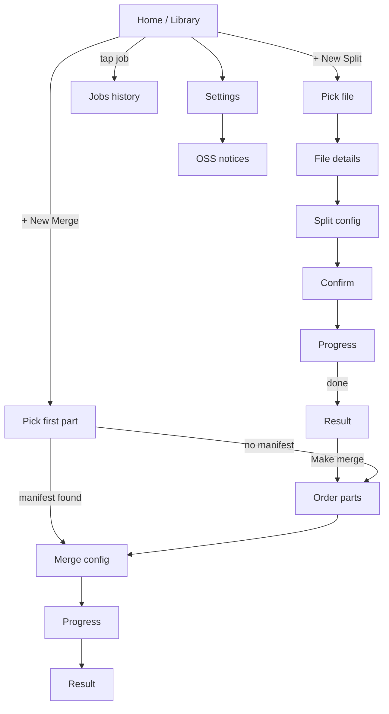

# 08 — UI Flow & Screens (Stitch design brief)

This is what to feed into Google Stitch as a design brief, plus the complete Compose screen list.

## 8.1 Screen list (v1 minimum)

| # | Screen | Purpose |
|---|---|---|
| S1 | **Onboarding** (1 screen) | First-launch only. Ask SAF folder permission. Brand the app. |
| S2 | **Home / Library** | List of recent jobs (split + merge), big "+ New Split" / "+ New Merge" buttons. |
| S3 | **File Picker (split)** | Launches SAF `OPEN_DOCUMENT`; once a file is selected we land on… |
| S4 | **File Details** | Shows probed metadata: codec, resolution, HDR, audio tracks, subtitle tracks, duration, size. "Continue" button. |
| S5 | **Split Configuration** | Mode toggle (Exact parts / Size cap / Both), part-count slider, size-cap input (default 9 GB), output folder picker, output base-name input, summary card ("This will create N parts of ~X GB each"). |
| S6 | **Split Confirmation** | "We'll create 7 parts. ETA ~12 min. Cancel anytime. [Start]". |
| S7 | **Job Progress (split)** | Live progress bar, current part N of M, ETA, speed (e.g. "85 MB/s"), cancel button. Resilient to rotation. |
| S8 | **Split Complete** | Result list (each part with size + tap-to-share / open / delete). "Make merge from these" shortcut. |
| S9 | **Merge — Pick first part** | SAF picker; if a `*.split.json` manifest is found, jump to S11 directly. |
| S10 | **Merge — Order parts** | Drag-to-reorder list; mismatch warnings (red badge); "Add another part" button. |
| S11 | **Merge Configuration** | Output folder, output filename, summary card. |
| S12 | **Job Progress (merge)** | Same chrome as S7. |
| S13 | **Merge Complete** | "MyMovie.merged.mkv (50.2 GB) saved to /Movies. [Open] [Share] [Delete parts]". |
| S14 | **Jobs** (history) | Tab with all past jobs, filter by status. |
| S15 | **Settings** | Theme (Light/Dark/AMOLED/Dynamic), default cap (9 GB target / 9.5 GB ceiling), default output folder, link to Title Cleanup Patterns (S15a), **Check for updates** (per your apps' pattern), about / OSS notices. |
| S15a | **Title Cleanup Patterns** | List of regex rules used to clean filenames into folder/part names. Built-ins (toggleable). Custom user-added regexes (add/edit/delete/reorder). Live preview against a sample filename. |
| S16 | **Open-source Notices** | Standard list of bundled licenses. |

### Modal dialogs (not full screens)

- **D1 — Cleanup preview.** Before split starts, shows: original filename, cleaned title, derived folder name, derived part-name pattern. Three buttons: Edit title / Use as-is / Cancel.
- **D2 — Folder collision.** When the auto-derived subfolder already exists. Three buttons: Use existing folder / Auto-suffix `(1)` / Cancel.
- **D3 — Container promotion.** When input is MP4/AVI/MOV/TS and has bitmap subs. One-time info: "Output will be MKV to preserve all subtitles." Buttons: OK / Continue with original container (drops PGS subs).

## 8.2 Tablet / foldable two-pane

- S2 + S14 = master/detail (job list left, selected job right).
- S5 = single column on phone, two columns on tablet (config left, summary right).

## 8.3 Mermaid flow

## 8.4 What to ask Stitch for (design brief)

Paste this into Stitch when generating the design pack:

> Native Android app, Material 3, dark + light + AMOLED dark theme, dynamic colour. Screens for a video splitter / merger utility. Compact phone, foldable, tablet two-pane. Card-heavy, utilitarian, no marketing copy.
>
> **Screens to design:**
> 1. **Onboarding** — single illustration, two short paragraphs ("Split big videos into parts. Merge them back. Subtitles preserved."), one button "Pick output folder".
> 2. **Library / Home** — top app bar with title and search; list of recent jobs (each row: thumbnail + name + status chip + size + time); FAB with two actions (Split, Merge).
> 3. **File Details** — header with poster-shaped thumbnail (placeholder), title, file size; expandable cards: Video, Audio (multi-row), Subtitles (multi-row), Container; primary CTA "Configure split".
> 4. **Split Configuration** — segmented control (Exact parts / Size cap / Both); a numeric stepper for parts (2..50); a size-cap field with units toggle (GB/MB); output folder row; base-name text field; "Summary" card with predicted part count and size.
> 5. **Split Progress** — large circular progress with percent inside; below, current part text ("Part 3 of 7"); a speed line; ETA; cancel button (destructive).
> 6. **Split Complete** — green check, summary line, scrollable list of parts (size, status), three actions: Open folder / Share all / Make merge job.
> 7. **Merge — Order parts** — reorderable list of selected parts with handles; warnings shown inline as red rows for any incompatible parts; FAB "Add part".
> 8. **Merge Progress** — same chrome as Split Progress.
> 9. **Merge Complete** — same chrome as Split Complete; primary CTA Open file.
> 10. **Jobs** — list with chips for status filter, swipe-to-delete past completed jobs, swipe-to-cancel for running.
> 11. **Settings** — sectioned screen: Defaults, Updates, About; "Check for updates" with current version, last checked, action button; OSS notices link.
>
> **Component requirements:**
> - File-info row component (icon + label + value, multi-line value-wrap).
> - Stream-track chip (codec, language, indicator for default).
> - Progress card (circle + meta).
> - Job-status chip (queued/running/done/failed/cancelled).
> - Rich result row (file name, size, three icon actions).
>
> **Accessibility & behaviour notes for the designer:**
> - All long text fields multi-line with overflow ellipsis on second line.
> - Buttons reachable with one thumb on phone (bottom-anchored where possible).
> - Use the system app-icon shape for the launcher.
> - No avatar/social/profile elements.

## 8.5 What we will *not* design via Stitch

- Notification layout — Android system component, Material defaults are fine.
- Permission dialogs — system.
- File-picker UI — uses SAF (system).
- Share sheet — system.
- Update install screen — uses `PackageInstaller` system UI on Android 14+.

## 8.6 Theming

- **Material 3** with `MaterialTheme` + `dynamicColorScheme()` on Android 12+.
- Custom dark / AMOLED dark variants (`true black` for OLED).
- Typography: Material 3 default + a slightly tighter `bodyLarge` for dense lists.
- Iconography: Material Symbols (rounded variant).
