# 12 — Roadmap

Phased delivery plan. No time estimates — sequence and gates only, per house style.

## Phase 0 — Decisions (now)

**Gate to exit:** all questions in [11-OPEN-QUESTIONS.md](11-OPEN-QUESTIONS.md) answered.

Outputs:
- Confirmed answers committed in `analysis/11-OPEN-QUESTIONS.md` (or a sidecar file).
- Chosen FFmpeg artifact identified.
- Stitch design folder path agreed.

## Phase 1 — Agent + Prompt Authoring

**Inputs:** Phase 0 answers.
**Outputs:**
- `AGENTS.md` — combined rule set inheriting your KissKh / HTML Viewer style:
  - Build via `./gradlew assembleDebug`, no version bump on debug, ADB install path, log capture under `logs/`, plan-MD approval gate, AI/ documentation gate for releases.
- `MASTER-PROMPT.md` — the prompt you paste into Codex / Antigravity to scaffold + iterate on the project.
- `AI/` documentation skeleton (15 markdown files matching your KissKh structure: `README.md`, `ARCHITECTURE.md`, `SCREENS.md`, `SCREEN_FLOWS.md`, `KOTLIN_APP.md`, `DATA_MODELS.md`, `STATE_MANAGEMENT.md`, `COMPONENTS.md`, `PERMISSIONS.md`, `KNOWN_ISSUES.md`, `WORK_SUMMARY.md`, `tasks.md`, `CHANGELOG.md`, `API_USAGE.md`, `SCRAPERS.md` if applicable — we'll trim non-applicable ones).
- `update-codebase-graph.ps1` (your code-graph generator pattern, retargeted at Kotlin).
- `deploy_release.ps1` (your deploy pattern, retargeted at this app).

**Gate to exit:** you approve the AGENTS.md and master prompt.

## Phase 2 — Stitch Design Import

**Inputs:** Stitch-generated design folder (light + dark variants per [08](08-UI-FLOW-AND-SCREENS.md)).
**Outputs:**
- Designs copied into `Kotlin APK/design/`.
- A `design/INDEX.md` mapping each Stitch folder to its corresponding Compose screen file.

**Gate to exit:** index complete; you confirm the screen-by-screen mapping.

## Phase 3 — Project Scaffolding (run by Codex/Antigravity, you approve)

**Inputs:** AGENTS.md + master prompt + designs.
**Outputs:**
- Android Studio project at `Kotlin APK/` (no Gradle import errors).
- `app` module with theme, nav, placeholder screens (each screen renders the Stitch layout statically with mock data).
- DI graph (Hilt) wired.
- Room schema with empty DAOs.
- `engine/` package present but stubbed (returns hardcoded probe data).
- A debug build that installs to your device and shows the Library screen.

**Gate to exit:** debug APK installs and navigates through every screen with mock data.

## Phase 4 — Engine: Probe + Keyframe Find

**Inputs:** chosen FFmpeg artifact integrated.
**Outputs:**
- `FfprobeEngine` returns real metadata for any file passed via SAF.
- `KeyframeFinder` returns sorted timestamps.
- Unit tests for `ProgressParser` and a JVM-side `CutPlanner` (no FFmpeg needed for planning logic).
- Instrumented `EngineSmokeTest` runs `-version` and a 5-second copy on a 720p fixture.

**Gate to exit:** smoke test passes on emulator + your physical device.

## Phase 5 — Engine: Split

**Outputs:**
- `Splitter.runSplit(job)` produces N MKV parts on disk for a real input.
- Manifest `*.split.json` written.
- Foreground service shows live progress.
- Cancel works cleanly.
- Verification + auto-resplit when a part exceeds cap.

**Gate to exit:** end-to-end test on a real 4K MKV (≥ 20 GB) on your physical device, parts play in VLC with subtitles.

## Phase 6 — Engine: Merge

**Outputs:**
- `Merger.runMerge(job)` consumes either a manifest or a user-ordered list, validates, and emits a single MKV.
- Round-trip elementary-stream MD5 equality verified manually for one test file.

**Gate to exit:** merged file passes round-trip MD5 check.

## Phase 7 — Polish + Settings + Update Check

**Outputs:**
- Settings (theme, default cap, default folder, update check).
- `Check for updates` flow per your KissKh pattern.
- Notification with progress + cancel.
- Permission flow (POST_NOTIFICATIONS prompt, SAF folder grant).
- Onboarding screen.
- OSS notices screen.

**Gate to exit:** all S1..S16 screens functional, no placeholder data.

## Phase 8 — Release v0.0.1

**Inputs:** AI/ docs current, CHANGELOG written, version bump approved (your double-gate rule).
**Outputs:**
- `app-release.apk` signed.
- GitHub release `v0.0.1` with APK attached.
- `mkvslice-version.json` published in releases repo.
- Tag `v0.0.1` on main repo.

**Gate to exit:** in-app update check on a v0.0.1-installed phone announces "Up to date".

## Phase 9 — v0.0.2 .. v0.0.99 (incremental polish & bugfixes)

Per your `0.0.x` series rule: keep going up to 0.0.99 before asking about the major bump.

Likely contents:

- v0.0.2: SAF-import "copy to local cache" so cloud-backed inputs work.
- v0.0.3: Resume cancelled jobs.
- v0.0.4: Per-output-name template.
- v0.0.5: Tablet two-pane.
- v0.0.6: Strip-metadata toggle.
- v0.0.7: Audio-track / subtitle-track filters.
- v0.0.8: HEVC / AV1 hardware-decoder thumbnails on file-details screen.
- v0.0.9..0.0.99: bugs, perf, polish.

## Phase 10 — v1.1.0 (your post-0.0.99 jump rule)

Major-feature release candidates:
- Migrate engine to in-house FFmpeg build (mitigates archival risk).
- Multi-input batch jobs.
- Custom split-by-time (not just count or size).
- Re-encode mode for files with too-few keyframes (graceful degradation).

## Roadmap dependency graph

```mermaid
gantt
    title Phase dependencies (sequence-only)
    dateFormat  X
    axisFormat  %s
    section Foundations
    Phase 0 Decisions      :done,    p0, 0, 1
    Phase 1 Agent+Prompt   :         p1, after p0, 1
    Phase 2 Stitch Import  :         p2, after p0, 1
    section Build
    Phase 3 Scaffolding    :         p3, after p1 p2, 1
    Phase 4 Probe          :         p4, after p3, 1
    Phase 5 Split          :         p5, after p4, 1
    Phase 6 Merge          :         p6, after p5, 1
    section Ship
    Phase 7 Polish+Updates :         p7, after p6, 1
    Phase 8 Release v0.0.1 :         p8, after p7, 1
    Phase 9 v0.0.x Series  :         p9, after p8, 3
    Phase 10 v1.1+         :         p10, after p9, 1
```

