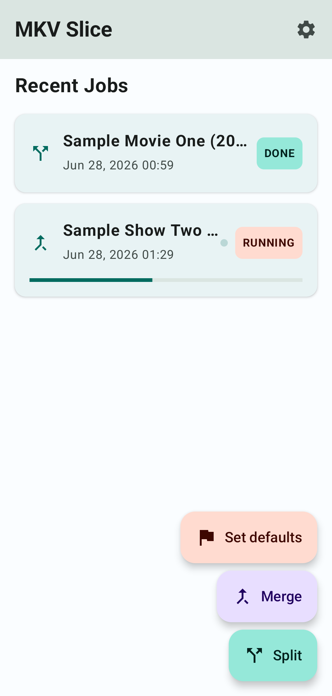
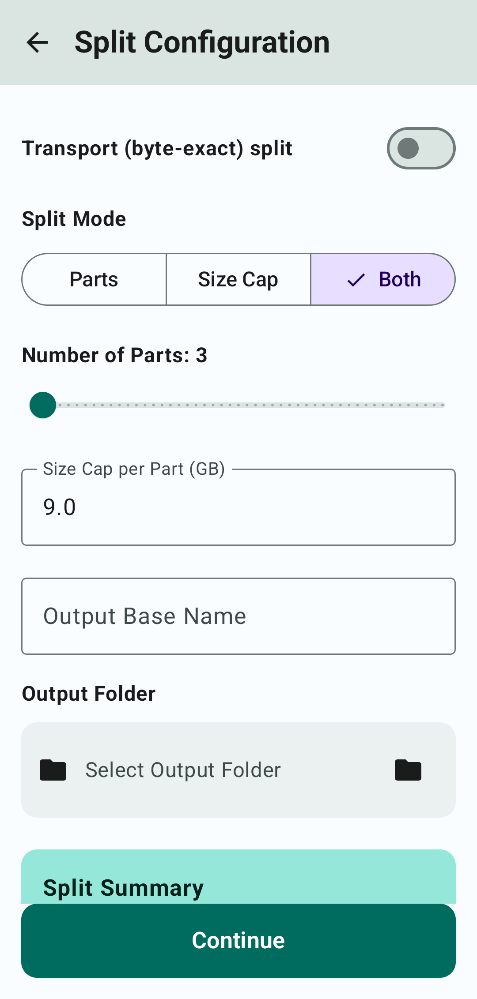
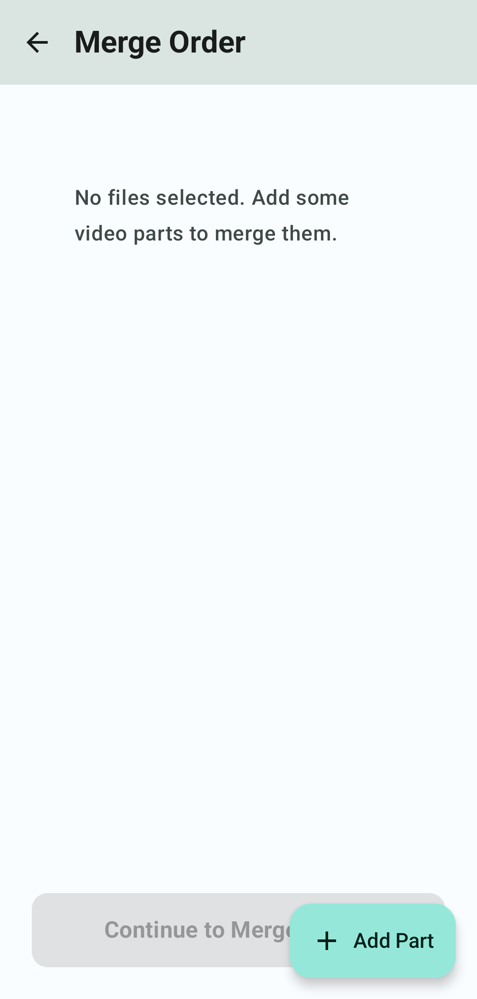
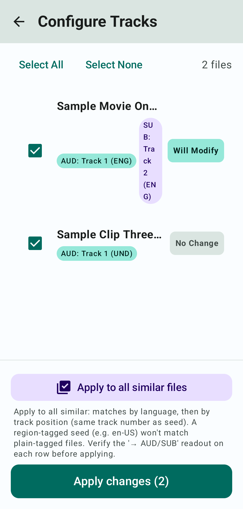
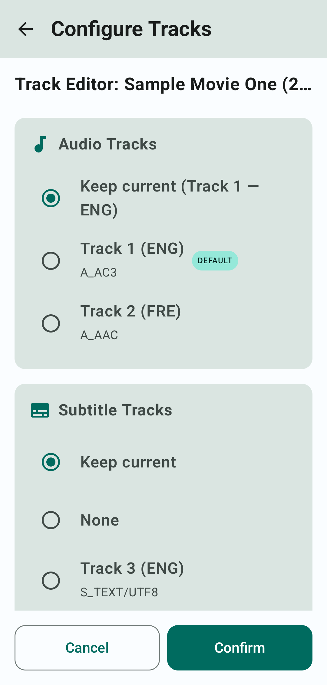
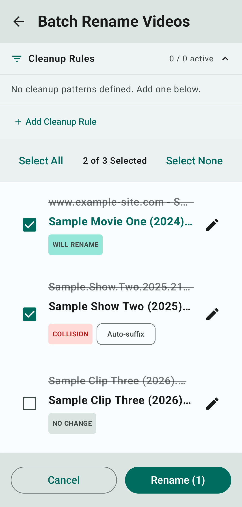
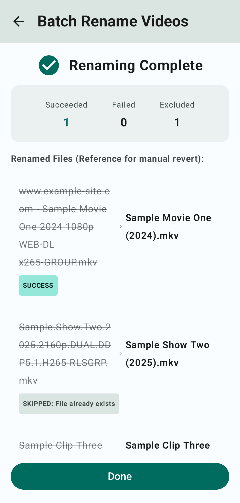
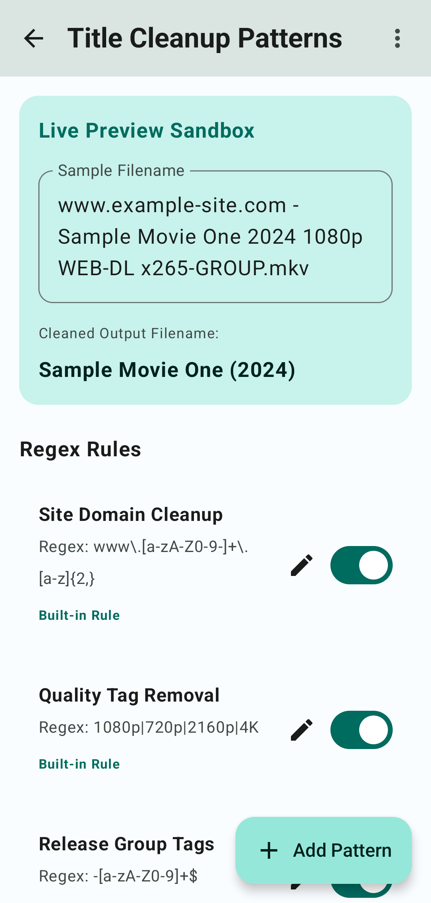

# Video Splitter & Merger - Usage Guide

This guide provides detailed instructions on how to use all the major features of the **Video Splitter & Merger** application.

---

## 1. Library / Home Screen

The Library screen displays your execution history. Tap on the floating action buttons to start a new flow, or select any job card to view its status.

### Key Actions
1. **Split Video**: Split files by size cap or part quantity.
2. **Merge Video Parts**: Rejoin parts without re-encoding.
3. **Set Default Tracks**: Reconfigure default/forced streams on MKVs.
4. **Rename Videos (Batch)**: Clean video titles in batch.

---

## 2. Splitting Video Files

Configure size caps in GB or specify part quantities. Segment positions are pre-calculated to ensure they align to Keyframe boundaries, maintaining compatibility and preventing visual corruption.

### Steps
1. Select a video from the system file picker.
2. Enter a custom **Size Cap (GB)** or select **Part Count**.
3. Tap **Confirm** to check the segment boundaries.
4. Tap **Confirm Split** to launch the split process in place.

---

## 3. Merging Video Parts

Merge multiple video parts chronologically. Drag and drop rows to adjust the ordering before joining.

### Steps
1. Tap the **Merge** action on the Home Screen.
2. Pick video files from the picker.
3. Long press and drag rows to change their chronological order.
4. Tap **Continue** to set the output filename and directory.
5. Tap **Merge** to execute the fast concatenate operation.

---

## 4. Set Default Tracks

Configure default and forced audio/subtitle flags inside Matroska files in batch without re-encoding.

### Steps
1. Tap the **Set Default Tracks** flow on the Home Screen.
2. Pick a single MKV file or scan an entire folder recursively.
3. Tap on a file row to open the **Track Editor**.
4. Select your preferred default audio stream, subtitle stream, and forced flag.
5. Tap **Confirm** to save your preferences.
6. Use **Apply to all similar files** to match similar files (by language or position) to the seed preferences automatically.
7. Click **Apply Changes** to write to files.

---

## 5. Batch Rename Videos

Scan folders and clean video titles in batch in place.

### Steps
1. Tap **Rename Videos** from settings or the library screen.
2. Pick video files or scan a folder.
3. Review the preview list showing the "Before" (crossed out) and "After" (green highlights) names.
4. Add new regex patterns or toggle active patterns to refine cleaning.
5. Tap **Rename** to apply names on disk.

---

## 6. Title Cleanup Patterns

Define and configure regex rules to strip out garbage tags, links, and text from video titles.

### Steps
1. Navigate to **Settings** -> **Title Cleanup Patterns**.
2. Toggle checkboxes to enable/disable specific rules.
3. Test your rules instantly using the sample input text field at the bottom.
4. Use the backup/restore actions to export or import your patterns to/from a JSON file.

---

## 7. App Update Check

Get notified when a new release is available, with support for automatic SHA-256 integrity verification before installation.

### Steps
1. Open **Settings**.
2. Tap **Check for updates**.
3. If an update is available, review the changelog and tap **Download & Install**.
